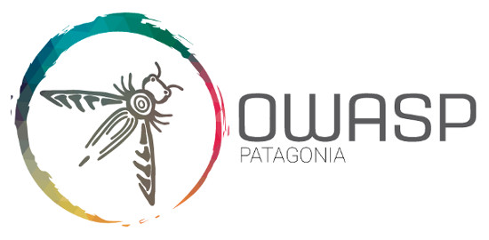

---

layout: col-sidebar
title: OWASP Patagonia
tags: patagoniaTabs
level: 0

region: Latin America

---

El capítulo local "OWASP Patagonia" tiene como principal objetivo compartir conocimiento, experiencias, técnicas, enseñanzas y todo aquello que aporte para que nuestra región siga creciendo y se encuentre a la vanguardia en temas relacionados a la seguridad de la información. También deseamos que OWASP Patagonia sea un punto de encuentro y difusión para las distintas actividades que se llevan a cabo en la región.

