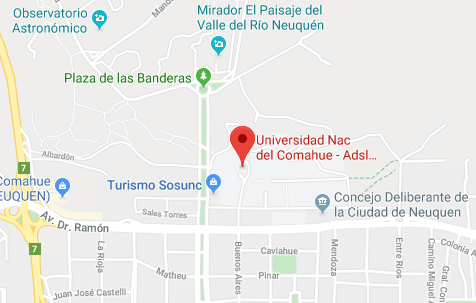

---

title: LT-2016
layout: null
tab: true
order: 2
tags: Patagonia
---

## Latam Tour 2016

Invitamos a estudiantes, desarrolladores, expertos en seguridad informática y curiosos en general a compartir con la comunidad de OWASP un nuevo evento en la Patagonia! Será una jornada de charlas técnicas, en un ambiente relajado e ideal para conocer otras personas interesadas en la seguridad.

### Registro

El registro a las charlas es libre y gratuito.

### Agenda 

Viernes 15 de abril, Neuquén. De 9:00hs a 17:00hs.

*A partir de las 9:00hs estaremos en el salón para realizar la acreditación, a las 10:00hs inician las charlas.*

  - 09:00 - 10:00 . Acreditación 
  - 10:00 - 10:15 . Presentación 
  - 10:15 - 10:55 . **Diego Cotelo**: XSS - from alert to pwnage
  - 10:55 - 11:30 . Pausa para café 
  - 11:30 - 12:10 . **Sheila Berta**: Threat not found!
  - 12:10 - 12:50 . **José Garduño**: Revisiting hardware keyloggers, say hi to MIKEY
  - 12:50 - 14:20 . Pausa para almuerzo 
  - 14:20 - 15:00 . **Victor Figueroa**: S-SDLC: Threat Modeling
  - 15:00 - 15:40 . **Christian Vila**: Evil 3 Full Analisys – Ciberterrorismo, APT & Deep Internet
  - 15:40 - 16:10 . Pausa para café 
  - 16:10 - 16:50 . **Federico Kirschbaum**: Ataques a serializaciones (JAVA/PHP)
  - 16:50 - 17:00 . Agradecimientos y clausura

### ¿Dónde?

Salón azul, Universidad Nacional del Comahue, Buenos Aires 1400, Neuquén.

### Agradecimientos

