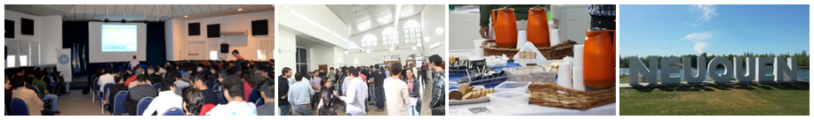

---

title: LT-2019
layout: null
tab: true
order: 5
tags: Patagonia
---

## Latam Tour 2019

Invitamos a estudiantes, desarrolladores, expertos en seguridad informática y curiosos en general a compartir con la comunidad de OWASP un nuevo evento en la Patagonia! Será una jornada de charlas técnicas, en un ambiente relajado e ideal para conocer otras personas interesadas en la seguridad.

### Registro

El registro a las charlas es libre y gratuito.

### Agenda

Viernes 26 de abril, Neuquén. De 9:00hs a 17:00hs.

*A partir de las 9:00hs estaremos en el salón para realizar la acreditación, a las 10:00hs inician las charlas.*

  - 09:00 - 10:00 . Acreditación 
  - 10:00 - 10:15 . Presentación 
  - 10:15 - 10:55 . **Sheila Berta**: The Art of Persistence: "Mr. Windows... I don't wanna go :(" - [Descargar slides](assets/slides/LatamTour/2019/Berta-ArtOfPersistence.pdf)
  - 10:55 - 11:25 . Pausa para café 
  - 11:25 - 12:05 . **Alvaro Chirou**: Quien no espía el mundo, es porque no quiere - [Descargar slides](assets/slides/LatamTour/2019/Chirou-OSINT.pdf) 
  - 12:05 - 12:45 . **Nahuel Grisolia**: Rompiendo Autenticaciones Federadas - [Descargar slides](assets/slides/LatamTour/2019/Grisolia-AutenticacionesFederadas.pdf) 
  - 12:45 - 14:15 . Pausa para almuerzo 
  - 14:15 - 14:25 . **Victor Figueroa**: Charla sobre CSIRT - [Descargar slides](assets/slides/LatamTour/2019/Figueroa-CSIRT.pdf) 
  - 14:25 - 15:05 . **Gustavo Sorondo**: Pentesting de aplicaciones móviles - [Descargar slides](assets/slides/LatamTour/2019/Sorondo-MobileApps.pdf) 
  - 15:05 - 15:35 . Pausa para café 
  - 15:35 - 16:15 . **Yamila Levalle**: Accediendo a Secretos Corporativos a través de Videoconferencias - [Descargar slides](assets/slides/LatamTour/2019/Levalle-M33tfinder.pdf) 
  - 16:15 - 17:00 . **Daniel Isler**: Let the RAT be your fr1end 

### ¿Dónde?

Aula Magna, Universidad Nacional del Comahue, Buenos Aires 1400, Neuquén.

### Agradecimientos

